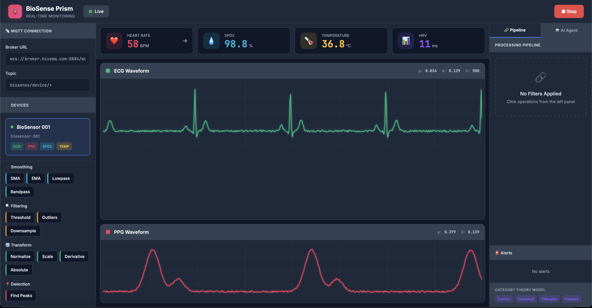

<p align="center">
  
</p>

<h1 align="center">🫀 BioSense Prism</h1>

<p align="center">
  <strong>Real-time biosensor data visualization and analysis platform</strong>
</p>

<p align="center">
  <a href="#-features">Features</a> •
  <a href="#-quick-start">Quick Start</a> •
  <a href="#-roadmap">Roadmap</a> •
  <a href="#-architecture">Architecture</a> •
  <a href="#-contributing">Contributing</a>
</p>

<p align="center">
  
  
  
  
</p>

---

## ✨ Features

| Feature | Description |
|---------|-------------|
| 📊 **Real-time Waveforms** | ECG and PPG visualization at 250 Hz |
| ❤️ **Vitals Monitoring** | Heart rate, SpO2, Temperature, HRV |
| 🔮 **Signal Processing** | Composable filter pipeline (SMA, EMA, Lowpass, etc.) |
| 🤖 **AI Health Agent** | Chat interface for data insights |
| 📡 **MQTT Integration** | WebSocket-based sensor data ingestion |
| 🚨 **Alert System** | Configurable health alerts |

---

## 🚀 Quick Start

### Option 1: Open Directly
```bash
# Just open the HTML file in your browser
open biosense-prism.html
```

### Option 2: Local Server
```bash
# Python
python -m http.server 8080

# Node.js  
npx serve .
```

Then visit `http://localhost:8080`

### Try It Out
1. Click **▶ Start** to begin mock sensor stream
2. Watch real-time ECG and PPG waveforms
3. Add signal processing filters from the left panel
4. Switch to **🤖 AI Agent** tab and ask questions about your vitals

---

## 🏗️ Architecture

```
┌─────────────────────────────────────────────────────────────────────────────┐
│                                                                             │
│   ┌─────────────┐     ┌─────────────┐     ┌─────────────────────────────┐  │
│   │   Sensors   │     │ Controllers │     │         MQTT Broker         │  │
│   │             │     │             │     │                             │  │
│   │ • MAX30102  │────▶│ • ESP32     │────▶│  • Mosquitto / HiveMQ       │  │
│   │ • AD8232    │     │ • RPi       │     │                             │  │
│   │ • MLX90614  │     │ • Arduino   │     │                             │  │
│   └─────────────┘     └─────────────┘     └──────────────┬──────────────┘  │
│                                                          │                 │
│                                          ┌───────────────┼──────────────┐  │
│                                          │               │              │  │
│                                          ▼               ▼              │  │
│                               ┌─────────────────┐ ┌────────────────┐    │  │
│                               │   Go Backend    │ │  Browser UI    │    │  │
│                               │   (Phase 5)     │ │  ✅ Phase 1    │    │  │
│                               │                 │ │                │    │  │
│                               │ • Processing    │ │ • React        │    │  │
│                               │ • Storage       │ │ • Filters      │    │  │
│                               │ • REST API      │ │ • LLM Agent    │    │  │
│                               └─────────────────┘ └────────────────┘    │  │
│                                                                         │  │
└─────────────────────────────────────────────────────────────────────────────┘
```

---

## 📊 Signal Processing Pipeline

Composable operations you can chain together:

```
┌──────────────────────────────────────────────────────────────────────────┐
│                         Available Operations                             │
├───────────────────┬───────────────────┬──────────────────────────────────┤
│    SMOOTHING      │     FILTERING     │     TRANSFORM & DETECTION        │
├───────────────────┼───────────────────┼──────────────────────────────────┤
│ • SMA (window)    │ • threshold()     │ • normalize                      │
│ • EMA (alpha)     │ • removeOutliers  │ • scale(k)                       │
│ • lowpass(cutoff) │ • downsample      │ • derivative                     │
│ • bandpass(l, h)  │                   │ • detectPeaks → HR, HRV          │
└───────────────────┴───────────────────┴──────────────────────────────────┘
```

**Example Pipeline:**
```
Raw ECG → Bandpass(0.5, 40Hz) → SMA(5) → Normalize → Detect Peaks → Calculate HR
```

---

## 🗺️ Roadmap

### Phase 1: Foundation ✅ (Current)

- [x] React-based UI with professional styling
- [x] Mock MQTT sensor simulation (250 Hz ECG, 100 Hz PPG)
- [x] Real-time waveform visualization
- [x] Vitals display (HR, SpO2, Temp, HRV)
- [x] Signal processing pipeline
- [x] AI Health Agent chat interface
- [x] Alert system

### Phase 2: Sensor Integration 🎯

| Sensor | Interface | Use Case | Difficulty |
|--------|-----------|----------|------------|
| **MAX30102** | I2C | SpO2 + PPG | ⭐⭐ |
| **AD8232** | Analog | Single-lead ECG | ⭐⭐⭐ |
| **MLX90614** | I2C | Non-contact temp | ⭐⭐ |
| **MPU6050** | I2C | Motion/fall detection | ⭐⭐ |
| **DS18B20** | 1-Wire | Body temperature | ⭐ |

**Recommended first sensor:** MAX30102 (~$5, easy to wire, gives you PPG + SpO2)

### Phase 3: Controller Integration 🎯

| Controller | Best For | Connectivity | Cost |
|------------|----------|--------------|------|
| **ESP32** | Beginners, WiFi projects | WiFi + BLE | ~$8 |
| **Raspberry Pi** | Complex processing | Ethernet/WiFi | ~$35 |
| **Arduino Nano** | Learning basics | Serial → Bridge | ~$5 |

**Recommended:** Start with ESP32 - it has WiFi built-in!

### Phase 4: Advanced Signal Processing

- [x] Pan-Tompkins R-peak detection algorithm
- [x] HRV analysis (SDNN, RMSSD, pNN50)
- [x] Frequency analysis with FFT
- [x] Respiratory rate extraction from PPG
- [x] Noise filtering and artifact removal

### Phase 5: Data Persistence

- [x] Go backend with MQTT subscriber
- [ ] TimescaleDB for time-series storage
- [ ] REST API for historical queries
- [x] WebSocket server for real-time streaming
- [ ] Data export (CSV, JSON)

### Phase 6: LLM Integration

- [ ] Connect to real LLM API (OpenAI/Claude/Local)
- [ ] Context-aware prompts with vital data
- [ ] Chat history
- [ ] Health disclaimers

### Phase 7-9: Future Ideas

- [ ] Push notifications & email alerts
- [ ] Mobile app (React Native)
- [ ] Bluetooth Low Energy direct connection
- [ ] Apple HealthKit / Google Fit sync
- [ ] Anomaly detection with ML

---

## 📁 Project Structure

```
biosense-prism/
├── ui/
│   └── biosense-prism.html    # Main UI (Phase 1 ✅)
├── sensors/
│   ├── max30102/              # SpO2 + PPG sensor
│   ├── ad8232/                # ECG sensor
│   └── mlx90614/              # Temperature sensor
├── controllers/
│   ├── esp32/                 # ESP32 firmware
│   ├── raspberry-pi/          # RPi Python scripts
│   └── arduino/               # Arduino sketches
├── backend/                   # Go backend (Phase 5)
├── assets/
│   └── biosense-preview.svg   # Animated preview
└── README.md
```

---

## 🔌 MQTT Message Format

All sensors should send data in this format:

```json
{
  "deviceId": "esp32-001",
  "timestamp": 1702055432123,
  "sensors": {
    "ecg": { "value": 0.42, "unit": "mV", "sampleRate": 250 },
    "ppg": { "value": 45230, "unit": "raw", "sampleRate": 100 },
    "spo2": { "value": 98.2, "unit": "%" },
    "temp": { "value": 36.6, "unit": "C" }
  },
  "battery": 85,
  "rssi": -45
}
```

---

## 🛠️ ESP32 Quick Start

Here's a minimal example to get sensor data flowing:

```cpp
#include <WiFi.h>
#include <PubSubClient.h>
#include <ArduinoJson.h>
#include "MAX30105.h"

MAX30105 sensor;
WiFiClient wifi;
PubSubClient mqtt(wifi);

void setup() {
  Serial.begin(115200);
  
  // Connect to WiFi
  WiFi.begin("YourWiFi", "YourPassword");
  while (WiFi.status() != WL_CONNECTED) {
    delay(500);
    Serial.print(".");
  }
  Serial.println("WiFi connected!");
  
  // Connect to MQTT broker
  mqtt.setServer("broker.hivemq.com", 1883);
  
  // Initialize sensor
  sensor.begin();
  sensor.setup();
}

void loop() {
  if (!mqtt.connected()) {
    mqtt.connect("esp32-biosense");
  }
  mqtt.loop();
  
  // Read sensor
  uint32_t ir = sensor.getIR();
  
  // Build JSON message
  StaticJsonDocument<256> doc;
  doc["deviceId"] = "esp32-001";
  doc["timestamp"] = millis();
  doc["sensors"]["ppg"]["value"] = ir;
  
  // Send to MQTT
  char buffer[256];
  serializeJson(doc, buffer);
  mqtt.publish("biosense/device/esp32-001", buffer);
  
  delay(10); // ~100 Hz
}
```

---

## 📚 Learning Resources

### Signal Processing
- 📚 [Think DSP](https://greenteapress.com/wp/think-dsp/) - Free online book
- 📺 [3Blue1Brown - Fourier Transform](https://www.youtube.com/watch?v=spUNpyF58BY) - Great visual explanation
- 📖 [ECG Basics](https://litfl.com/ecg-library/) - Understanding heart rhythms

### Hardware & Electronics
- 📺 [Andreas Spiess YouTube](https://www.youtube.com/c/AndreasSpiess) - ESP32 tutorials
- 📚 [ESP32 Getting Started](https://randomnerdtutorials.com/getting-started-with-esp32/)
- 📖 [MAX30102 Tutorial](https://lastminuteengineers.com/max30102-pulse-oximeter-heart-rate-sensor-arduino-tutorial/)

### MQTT
- 📚 [MQTT Essentials](https://www.hivemq.com/mqtt-essentials/) - Learn the protocol
- 🔧 [MQTT Explorer](http://mqtt-explorer.com/) - Desktop tool to debug MQTT
- 🌐 [HiveMQ Public Broker](https://www.hivemq.com/public-mqtt-broker/) - Free broker for testing

### Web Development
- 📚 [React Docs](https://react.dev/) - Official React documentation
- 📺 [Fireship YouTube](https://www.youtube.com/c/Fireship) - Quick web dev tutorials

---

## 👋 Contributing

### Getting Started

1. **Fork the repository**
2. **Pick a task** from any phase above
3. **Create a branch**: `feature/phase-X-task-name`
4. **Build something cool!**
5. **Submit a PR** with screenshots/video

### Suggested First Week for Interns

| Day | Task |
|-----|------|
| 1 | Run `biosense-prism.html` in browser, click around |
| 2 | Read the JavaScript code, understand the signal processing |
| 3 | Install Arduino IDE, set up ESP32 board |
| 4 | Order a MAX30102 sensor (~$5 on Amazon/AliExpress) |
| 5 | Try connecting ESP32 to WiFi, print "Hello" to Serial |
| Weekend | Wire up the sensor, read some values! |

### Code Style

- **JavaScript**: Functional components, React hooks
- **Go**: Standard `gofmt` conventions  
- **Python**: PEP 8
- **Commits**: Use prefixes like `feat:`, `fix:`, `docs:`

### Questions?

Open a GitHub Issue! No question is too basic. We're all here to learn. 🙌

---

## 📄 License

MIT License - Build cool stuff, learn lots, share with others! 💚

---

<p align="center">
  <strong>🎯 The goal is to LEARN. Don't worry about perfection.<br/>Ask questions. Break things. Have fun! 🚀</strong>
</p>
